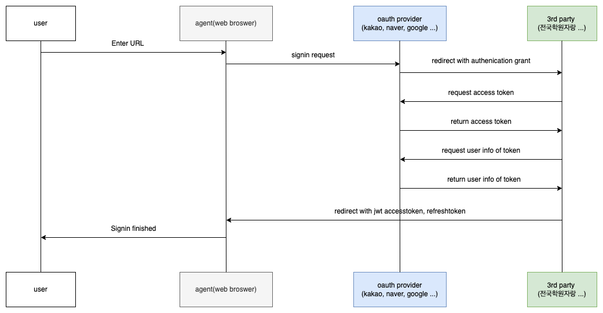

# 전국학원자랑 (진행중)

## 프로젝트 개요
소도시일수록 교육정보에 대한 불균형이 큽니다.

'전국학원자랑'은 그것을 코딩으로 해결하는 과정을 경험해보고자 시작한 프로젝트입니다.

웹 서비스를 통해 학원 및 과외를 홍보하거나 정보를 찾을 수 있고, 리뷰와 교육정보들을 확인할 수 있습니다.

 

백엔드 서버(API)와 클라이언트(Vue.js)로 구성되어 있습니다.

 

## Frameworks

  

## IDE

 

## TECHS
### JWT 기반의 사용자 인증
JWT(JSON WEB TOKEN)는 정보를 JSON을 사용하여 안전하게(손상, 위조여부 확인) 통신하기 위한 개방된 표준입니다. JWT는 웹 애플리케이션에서 인증 및 권한 부여 목적으로 자주 사용되고 있습니다.

JWT는 헤더, 페이로드, 서명의 세 부분으로 구성됩니다. 헤더는 토큰의 유형과 서명에 사용되는 알고리즘을 정의합니다. 페이로드에는 사용자와 관련된 정보와 추가로 필요로 하는 데이터들이 포함됩니다. JWT의 서명은 헤더와 페이로드정보를 기반으로 비밀키를 사용하여 생성됩니다. 이후 수신자가 헤더와 페이로드정보를 기반으로 비밀키를 사용하여 서명을 만든후 jwt토큰의 서명과 비교해보면 위조여부를 확인할수 있습니다.

### 로컬 계정 인증플로우
  

### 소셜 계정 (네이버) 사용시, 토큰과 분리된 프론트엔드(리액트, 뷰...) 에서의 jwt 인증플로우

- 먼저 백엔드의 소셜로그인을 위한 API로 요청을 보냅니다.
- 향후 백엔드에서 토큰발행후 원래의 프론트로 리다이렉트 할수 있도록 쿠키 설정 (authorizationRequestRepository)
- 서비스 프로바이더로 리다이렉트되어 소셜로그인 진행
- 소셜로그인 성공시 백엔드로 리다이렉트후 토큰 발행
- 토큰 정보와 함께 프론트로 다시 리다이렉트
- profit!

jwt 인증과정에서 엑세스토큰과 리프레시토큰을 사용하는 전략을 사용했습니다. 엑세스 토큰은 필요한 비즈니스 요청을 할때 사용하고, 리프레시 토큰은 엑세스 토큰의 재발행을 위해 사용합니다.

이를 위해 클라이언트가 사용자 이름 및 비밀번호와 같은 자격 증명을 제공하여 서버에 로그인 요청을 보내면, 서버는 자격 증명의 유효성을 검사하고 유효한 경우 액세스 토큰과 새로 고침 토큰의 두가지 토큰을 클라이언트에 발행합니다.

일반적으로 액세스 토큰은 수명이 짧고 리프레시 토큰은 수명이 깁니다. 이를 통해 엑세스 토큰이 유출되더라도 유효기간이 짧아서 리스크를 줄일수 있습니다.

또한 리프레시 요청시 엑세스토큰은 헤더에 Authorization 키로 설정하고 리프레시토큰은 쿠키로 설정하여 요청하도록 되어있습니다. 두종류의 토큰이 모두 있어야만 리프레시 요청이 가능하므로, csrf와 xss 공격에 대해 동시에 보완을 해보려 노력했습니다. 또한 리프레시 토큰은 데이터베이스에서 관리하므로, 리프레시 토큰이 탈취되거나 해당 유저가 부정을 저지르면 데이터베이스 레벨 에서 토큰을 무효화시킬수 있도록 구현했습니다.

### JWT의 특징을 공부한후 다음과 같이 정리해봤습니다.
- JWT는 Stateless 합니다. 인증에 필요한 모든 정보를 토큰에 자체적으로 저장할수 있고, 서명으로 이를 검증할수 있으므로 데이터베이스 요청없이 인증이 가능합니다. 따라서 시스템 아키텍처를 단순화하고 서버의 부하를 줄일 수 있습니다. 다만 토큰이 한번 발행되면 토큰을 무력화시킬수 없으므로 취약점이 있습니다.
- JWT는 인증/인가 서버를 넘어서서 어떤 서버에서도 처리와 생성이 가능하므로 탈중앙화된 특징이 있어서 마이크로서비스에 유리합니다.
- JWT는 JSON 이고, 이를 지원하는 언어와 라이브러리가 많아서 범용성이 높습니다. (웹, 앱 등등등)
- JWT는 페이로드의 용량제한이 없습니다. 이는 장단점으로 작용할수 있습니다.
